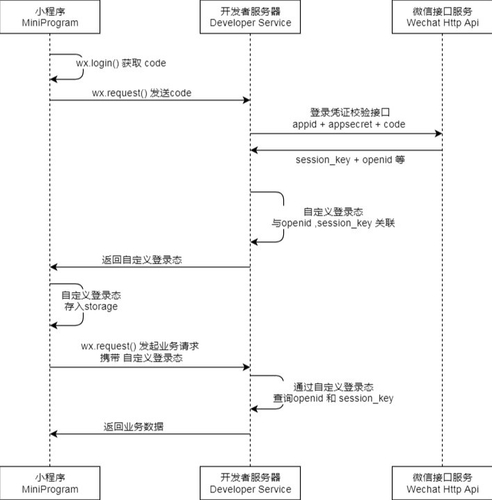

## 前后端配合实现小程序登录



1. 前端调用wx.login()获取微信临时登录凭证code。该code只能使用一次，code生成后5分钟失效
2. 将code传给后端，后端请求微信官方的jscode2session接口，换取微信用户唯一标识符OpenID和session_key。请求时需传递appId（小程序的唯一标识符）和secret（开发者密钥）
3. 对获取的OpenID进行JWT签名，作为用户登录凭证，并返回给前端
4. 前端将JWT存入Storage，以后每次请求都携带这个JWT
5. 后端验证JWT，若通过提取其中的Claim作为用户标识符，再进行相应的业务处理

后端代码

```java
@PostMapping("/user/login")
public Result login(@RequestParam("code") String code) throws IOException {
    String loginUrl = "https://api.weixin.qq.com/sns/jscode2session?appid=" + Const.appId +
        "&secret=" + Const.secret + "&js_code=" + code + "&grant_type=authorization_code";
    CloseableHttpClient client = null;
    CloseableHttpResponse response = null;
    // 创建httpGet请求
    HttpGet httpGet = new HttpGet(loginUrl);
    // 发送请求
    client = HttpClients.createDefault();
    // 执行请求
    response = client.execute(httpGet);
    // 得到返回数据
    HttpEntity entity = response.getEntity();
    String result = EntityUtils.toString(entity);

    response.close();
    client.close();
    System.out.println("微信返回的结果" + result);
    // 对返回的结果进行解析
    JSONObject json = JSONObject.parseObject(result);
    String openid = json.getString("openid");
    String sessionKey = json.getString("session_key");
    System.err.println("openid值： " + openid);
    System.err.println("sessionKey值" + sessionKey);

    User user = userService.getUserByOpenid(openid);

    if (StringUtils.isEmpty(openid)) {
        return Result.error("登录失败,openID错误");
    } else {
        String token = jwtUtils.generateToken(MapUtil.builder(new HashMap<String, Object>()).put("openId", openid).map());
        // 判断是否为首次登陆
        if (user == null) {
            userService.register(openid);
            user = new User();
            user.setUserId(openid);
            user.setUserName("微信用户");
            user.setPoints(0);
        }
        return Result.success(MapUtil.builder(new HashMap<String, Object>())
                              .put("user", user)
                              .put("token", token)
                              .map(), "登录成功");
    }
}
```

```js
login() {
    let _this = this;
    uni.showLoading({
        title: '登录中...'
    });
    // 获取登录用户 code
    uni.login({
        provider: 'weixin',
        success: function(res) {
            if (res.code) {
                let code = res.code;
                uni.request({
                    url: "http://127.0.0.1:8088/user/login",
                    method: 'POST',
                    header: {
                        'Content-Type': 'application/x-www-form-urlencoded'
                    },
                    data: {
                        code: res.code //wx.login 登录成功后的code 
                    },
                    success: function(cts) {
                        uni.setStorageSync('user', cts.data.data.user)
                        // 存储返回的JWT
                        uni.setStorageSync('token', cts.data.data.token)
                        uni.hideLoading();
                        uni.switchTab({
                            // 登录成功后的跳转
                            url: 'pages/home/home'
                        });
                    }
                });
            } else {
                uni.showToast({
                    title: '登录失败！',
                    duration: 2000
                });
                console.log('登录失败！' + res.errMsg)
            }
        },
  });
}
```

## JWT 拦截器

```java
public class JwtInterceptor implements HandlerInterceptor {
    @Autowired
    private JwtUtils jwtUtils;

    @Override
    public boolean preHandle(HttpServletRequest request, HttpServletResponse response, Object handler) {
        if("OPTIONS".equals(request.getMethod().toString())){
            // OPTIONS探测报文一律放行
            return true;
        }
        String token = request.getHeader("Authorization");
        String msg;
        if (StrUtil.isBlankOrUndefined(token)) {
            msg = "请先登录";  // 请求头Authorization为空
            ResponseUtils.writeRes(response, null, false, msg);
            return false;
        } else {
            try {
                Claims claims = jwtUtils.getClaimsByToken(token);
                if (jwtUtils.isUpdateNeed(claims)) {
                    // 若剩余时间少于过期时间一半， 需要更新
                    Map<String, Object> map = MapUtil.builder(new HashMap<String, Object>())
                            .put("id", claims.get("id")).map();
                    response.setHeader("Token", jwtUtils.generateToken(map));
                }
                // Controller层通过getAttribute获取openId
                request.setAttribute("openId", claims.get("openId"));
                return true;
            } catch (Exception e) { // JWT解析失败或过期
                if (e instanceof ExpiredJwtException) {
                    msg = "token已过期";
                } else {
                    msg = "token异常";
                }
                ResponseUtils.writeRes(response, null, false, msg);
                return false;
            }
        }
    }
}
```

## 验证码

验证码作用：

- 反爬虫
- 防止密码被暴力破解

这里使用谷歌的一个开源验证码库——kaptcha

```Java
<dependency>
    <groupId>com.github.axet</groupId>
    <artifactId>kaptcha</artifactId>
    <version>0.0.9</version>
</dependency>
```

### 添加配置

```Java
package com.krab.burger.config;

import com.google.code.kaptcha.impl.DefaultKaptcha;
import com.google.code.kaptcha.util.Config;
import org.springframework.context.annotation.Bean;
import org.springframework.context.annotation.Configuration;

import java.util.Properties;

@Configuration
public class CaptchaConfig {
    @Bean
    public DefaultKaptcha producer() {
        Properties properties = new Properties();
        properties.put("kaptcha.border", "no");
        properties.put("kaptcha.textproducer.font.color", "black");
        properties.put("kaptcha.textproducer.char.space", "4");
        properties.put("kaptcha.image.height", "40");
        properties.put("kaptcha.image.width", "120");
        properties.put("kaptcha.textproducer.font.size", "30");
        Config config = new Config(properties);
        DefaultKaptcha defaultKaptcha = new DefaultKaptcha();
        defaultKaptcha.setConfig(config);
        return defaultKaptcha;
    }
}
```

kaptcha支持很多自定义配置验证码的格式，具体配置去官方查看

### 验证码接口

```java
@RestController
@Slf4j
public class LoginController {
    @Autowired
    private Producer producer;
    
    @GetMapping("/captcha")
    public Result captcha() throws IOException {
        String code = producer.createText();
        String key = UUID.randomUUID().toString();
        BufferedImage image = producer.createImage(code);
        ByteArrayOutputStream outputStream = new ByteArrayOutputStream();
        ImageIO.write(image, "jpg", outputStream);
        BASE64Encoder encoder = new BASE64Encoder();
        String tag = "data:image/jpeg;base64,";
        String base64Img = tag + encoder.encode(outputStream.toByteArray()).replace("\r\n", "");
    
        redisUtils.hset(Const.CAPTCHA_KEY + key, code, 120);
        log.info("验证码 -- {} - {}", key, code);
    
        return Result.success(MapUtil.builder()
                .put("randID", key)
                .put("base64Img", base64Img).map(), "验证码获取成功");
    }
}
```

`Producer`哪来的？我们注册的`DefaultKaptcha`其实就是实现了`Producer`接口

### 验证码对应

显然发送验证码的时候用户尚未登录，且一个用户可以刷新验证码，会有不同用户都在请求验证码

假如给A的验证码是1234，给B的验证码是5678，B若发送1234过来验证，后端肯定不能让过，因为这是A对应的验证码。如何解决验证码对应问题呢？后端返回验证码图片时应该带上一个随机数，同时前端发送验证码数值过来时要带上这个随机数，UUID生成一个随机数`String key = UUID.`*`randomUUID`*`().toString();`

### 验证码存储

验证码属于使用比较频繁的，增加和删除频率高，采用redis存储比关系型数据块合适

```Java
package com.krab.burger.config;

import org.springframework.context.annotation.Bean;
import org.springframework.context.annotation.Configuration;
import org.springframework.data.redis.connection.RedisConnectionFactory;
import org.springframework.data.redis.core.RedisTemplate;
import org.springframework.data.redis.serializer.StringRedisSerializer;

@Configuration
public class RedisConfig {
    @Bean
    public RedisTemplate<String, Object> redisTemplate(RedisConnectionFactory connectionFactory) {
        RedisTemplate<String, Object> template = new RedisTemplate();
        // 默认的Key序列化器为: JdkSerializationRedisSerializer, 序列化对象时key可能会出现奇怪字符
        // 改成StringRedisSerializer方便阅读
        StringRedisSerializer stringRedisSerializer = new StringRedisSerializer();
        template.setKeySerializer(stringRedisSerializer);// key:采用字符串原文序列化保存
        template.setValueSerializer(stringRedisSerializer);// value:采用字符串原文序列化保存
        template.setHashKeySerializer(stringRedisSerializer);
        template.setConnectionFactory(connectionFactory);
        return template;
    }
}
```

使用spring封装的`RedisTemplate`，整个Util类

```Java
package com.krab.burger.utils;

import org.springframework.data.redis.core.RedisTemplate;
import org.springframework.stereotype.Component;

import javax.annotation.Resource;
import java.util.concurrent.TimeUnit;

@Component
public class RedisUtils {
    @Resource
    private RedisTemplate<String, Object> redisTemplate;

    public Object hget(String key){
        return redisTemplate.opsForValue().get(key);
    }

    public void hdel(String key){
        redisTemplate.delete(key);
    }

    public void hset(String key, Object value, Integer time){
        // time 设置过期时间
        redisTemplate.opsForValue().set(key, value, time, TimeUnit.SECONDS);
    }
}
```

```
redisUtils.hset(Const.`*`CAPTCHA_KEY `*`+ key, code, 120);
```

默认过期时间为120秒，2分钟